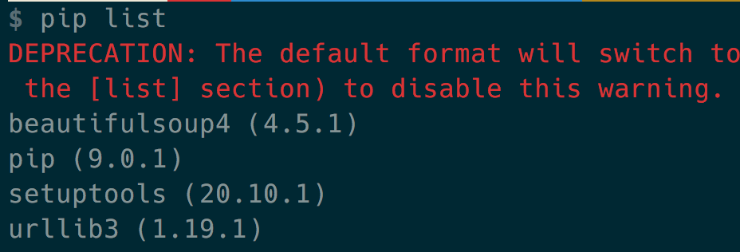
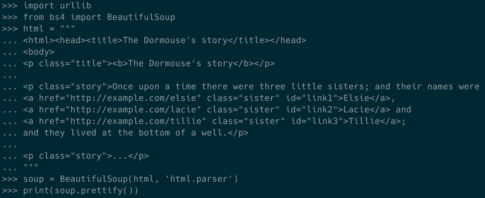

# Fastcampus 
## Computer Science SCHOOL
### Network Basic (2)
2017.4.24

---
<!--
page_number: true
$size: A4
footer : fastcampus 컴퓨터 공학 입문 스쿨, Wooyoung Choi, 2017
-->
## Civilization


---
## Web Programming

---
### Web architecture


---
### 웹 개발 패턴의 변화

- 1991 ~ 1999: Sir Timothy John "Tim" Berners-Lee가 하이퍼텍스트 기반의 프로젝트를 제안한 이후 정적인 컨텐츠들을 중심으로 한 웹 기술이 발달
- 1999 ~ 2009: Linux, Apache, Mysql, Php 중심의 동적인 서버, 정적인 클라이언트 모델이 지속됨
- 2010 ~ 현재: javaScript!! (Dynamic Web Client)

---
## Web Browser

---
## Mosaic(1993)


---
## Netscape(1994)


---
## Internet Explorer(1995)


---
## FireFox(2004)


---
## Chrome(2008)


---
## 웹 개발의 현재
### javaScript

---
## Client-side
- HTML/CSS, javaScript
- jQuery, AJAX
- Front-end Web Framework
	- AngularJS
	- React.js
	- Vue.js
- CSS Framework
	- Bootstrap
	- Foundation

---
## Server-side
- Depends on Language
	- PHP: Laravel
	- javaScript: Node.js(Express.js)
	- Java: Spring
	- C++, C#: ASP.net
	- Python: Django, Flask
	- Golang: itself
	- Ruby: Ruby on Rails

---
## Database
- RDBMS
	- MySQL
	- PostgreSQL
	- MariaDB
- noSQL
	- MongoDB
	- CouchDB
	- Redis


---
## etc
- celery (for Distributed Task Queue)
- github, Bitbucket, gitlab (for SCM)
- travis CI or jenkins (for Continuous Integration)
- slack, trello


---
## URI, URL, URN

### URI 
- Uniform Resource Information
- `https://www.example.com/post/how-to-make-url`
### URL 
- Uniform Resource Locator
- `https://www.example.com/post/`

### URN 
- Uniform Resource Name
- `www.example.com/post/how-to-make-url`

---
## REST API
`RE`presentational `S`tate `T`ransfer 
`A`pplication `P`rogramming `I`nterface

`Resource` - URI
`Verb` - HTTP method
`Representations` - 표현

---
## CRUD

### Create
### Read
### Update
### Delete

---
#### REST API 설계시 주의할 점

- 버전관리 https://api.foo.com/v1/bar
- 명사형 사용 https://foo.com/showid/ --> https://foo.com/user/
- 반응형 https://foo.com/m/user/, https://m.foo.com/user/ (x)
- 언어코드 https://foo.com/kr/, https://kr.foo.com/ (x)
- 응답상태 코드 (200, 400, 500)

---
## HTTP Response code

[wikipedia](https://en.wikipedia.org/wiki/List_of_HTTP_status_codes)

200, 201 - Success
400, 404 - Not found
500 - Server error

---


---
## Simple Server Framework: Flask
`$ pip install flask`
```python
from flask import Flask


app = Flask(__name__)

@app.route('/')
def index():
	return 'hello world!'
    
if __name__ == '__main__':
	app.run(host='0.0.0.0')
```

---
## c9.io
```
from flask import Flask
import os

app = Flask(__name__)

@app.route('/')
def index():
    return 'hello world!'

app.run(host=os.getenv('IP', '0.0.0.0'),port=int(os.getenv('PORT', 8080)))
```

---
## Simple Server Framework: Flask
```python
from flask import Flask, render_template


app = Flask(__name__)

@app.route('/')
def index(name=None):
	return render_template('index.html', name=name)

@app.route('/about')
def about(name=None):
	return render_template('about.html', name=name)

if __name__ == '__main__':
	app.run(host='0.0.0.0')
```

---
## Simple Server Framework: Flask

```
/
  simpleserver.py
  /templates
    index.html
    about.html
```

---

## Flask with `socket.io`


---
## Web Crawling with Python


---
## Scraping vs Crawling vs Parsing

Scraping: 데이터를 수집하는 행위


---
## Scraping vs Crawling vs Parsing
 
Crawling: 조직적 자동화된 방법으로 월드 와이드 웹을 탐색하는 것


---
## Scraping vs Crawling vs Parsing

Parsing: 문장 혹은 문서를 구성 성분으로 분해하고 위계관계를 분석하여 문장의 구조를 결정하는 것


---
## Caution!!
저작권 침해 위반 소지
- 웹사이트 운영자의 크롤링 금지 룰을 어길경우 
- 월권하여 데이터베이스에 접근
- 타인의 경제적 이익을 침해할 경우
- 개인정보를 수집할 경우(전화번호, 주소, ..)


---
## Beautiful Soup

---
## Web Scraping with Beautiful Soup

`$ pip install beautifulsoup4`


---
## Web Scraping with Beautiful Soup


---
## Web Scraping with Beautiful Soup


---
## Web Scraping with Beautiful Soup

```
import urllib
from bs4 import BeautifulSoup
html = """

uglified html code

"""
soup = BeautifulSoup(html, "html.parser")
print(soup.prettify())
```


---
## Web Scraping with Beautiful Soup
```
curl https://www.rottentomatoes.com
```

```python
import urllib.request
from bs4 import BeautifulSoup


url = "https://www.rottentomatoes.com"
html = urllib.request.urlopen(url)
source = html.read()
html.close()

soup = BeautifulSoup(source, "html.parser")
print(soup)

table = soup.find(id="Top-Box-Office")
print(table)
```

---
## Web Scraping with Beautiful Soup

```python
all_tr = table.find_all("tr")

for tr in all_tr:
     all_td = tr.find_all("td")
     score = all_td[0].find("span", attrs={"class":"tMeterScore"}).text
     movie_name = all_td[1].a.text
     amount = all_td[2].a.text
     print(score, movie_name, amount)
```

---
## Web Scraping with Beautiful Soup


---
## Web Scraping with Beautiful Soup


---
## So, Let's Scrap Naver