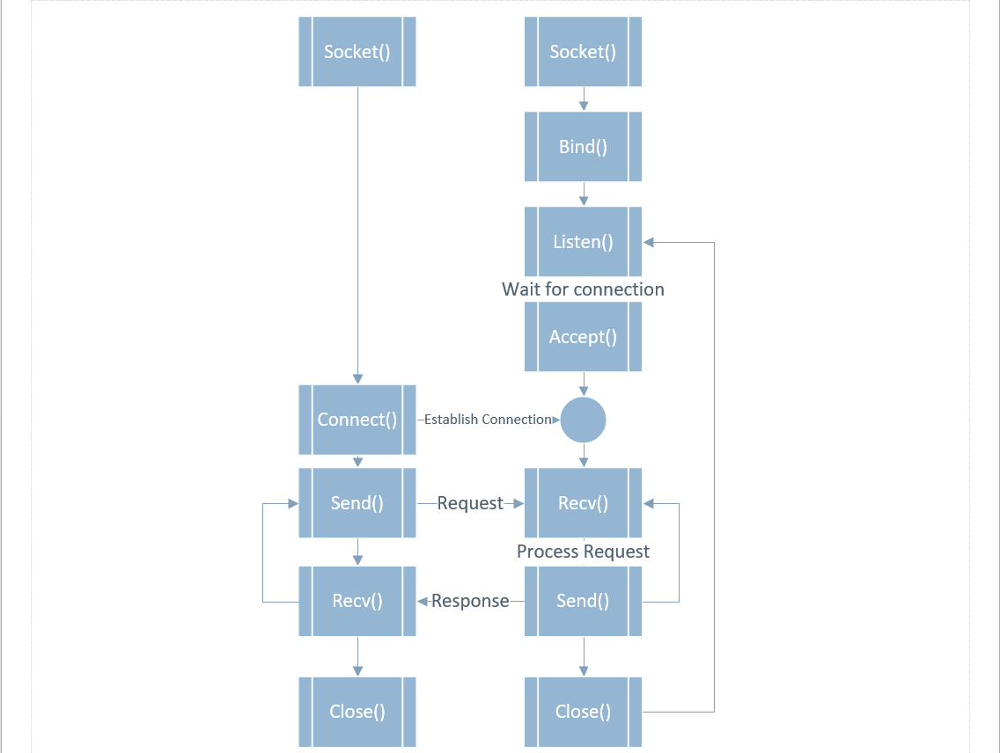
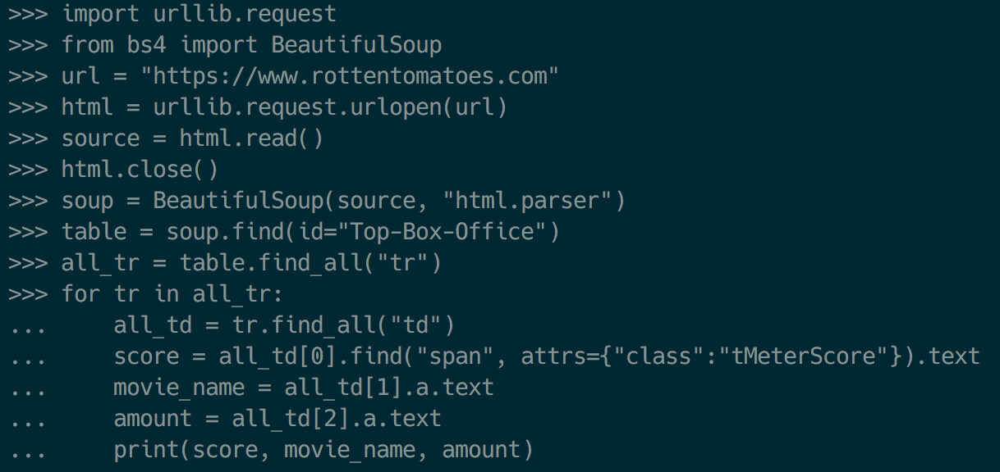

# Fastcampus 
## Computer Science SCHOOL
### Network Basic (2)
2017.4.24

---
<!--
page_number: true
$size: A4
footer : fastcampus 컴퓨터 공학 입문 스쿨, Wooyoung Choi, 2017
-->

## Socket

---


---
### parameters
socket family(family) - AF_INET, AF_UNIX, AF_BLUETOOTH
socket type(type) - SOCK_STREAM, SOCK_DGRAM

---
### setsockopt()
[setsockopt()](https://msdn.microsoft.com/en-us/library/windows/desktop/ms740476(v=vs.85).aspx) sets a socket option

[SOL_SOCKET](http://www.delorie.com/gnu/docs/glibc/libc_352.html) the level argument to getsockopt or setsockopt to manipulate the socket-level options described in this section.


[SO_REUSEADDR](https://msdn.microsoft.com/ko-kr/library/windows/desktop/ms740621(v=vs.85).aspx) for security(packet hijacking)


---
### socket 통신도 통신이므로.. 통신보안!!
TLS(Transport Layer Security) - 프로토콜에 의한 암호화
SSL(Secure Socket Layer) - 포트에 의한 암호화

---
## Websocket

---
## Websocket
> 웹사이트가 사용자와 상호작용하기 위해 만들어진 기술

W3C가 API를 관리
port:80, HTTP1.1


---
## Before Websocket
- HTTP Request, Response
- Hidden Frame
- Long Polling

---
## Differences between Socket, Websocket
Socket - HTTP run over TCP/IP
Websocket - run from web browser

---
## [Socket.io](https://socket.io/)
> browser 와 상관없이 js를 이용해 실시간 통신을 지원

- 브라우저와 웹 서버의 종류와 버전을 분석해 가장 적절한 기술로 통신
- WebSocket, FlashSocket, AJAX Long Polling, AJAX Multi part Streaming, IFrame, JSONP Polling을 추상화한 기술

---
## Civilization


---
## Web Programming

---
### Web architecture


---
### 웹 개발 패턴의 변화

```html
<html>
<head></head>
<body>
<h1>Static Header</h1>
<div>Static Contents</div>
</body>
</html>
```

- 1991 ~ 1999: Sir Timothy John "Tim" Berners-Lee가 하이퍼텍스트 기반의 프로젝트를 제안한 이후 정적인 컨텐츠들을 중심으로 한 웹 기술이 발달


---
### 웹 개발 패턴의 변화

```html
<html>
<head></head>
<body>
<h1></h1>
<div></div>
</body>
</html>
```

- 1999 ~ 2009: Linux, Apache, Mysql, Php 중심의 동적인 서버, 정적인 클라이언트 모델이 지속됨

---
### 웹 개발 패턴의 변화

```html
<html>
<head>
<script src="https://unpkg.com/vue"></script>
</head>
<body>
<h1>{{ header }}</h1>
<div id="app">
  {{ message }}
</div>
<script>
var app = new Vue({
  el: '#app',
  data: {
    message: '안녕하세요 Vue!'
  }
})
</script>
</body>
</html>
```

- 2010 ~ 현재: javaScript!! (Dynamic Web Client)


---
## Web Browser

---
## Mosaic(1993)


---
## Netscape(1994)


---
## Internet Explorer(1995)


---
## FireFox(2004)


---
## Chrome(2008)


---
## 웹 개발의 현재
### javaScript

---
## Client-side
- HTML/CSS, javaScript
- jQuery, AJAX
- Front-end Web Framework
	- AngularJS
	- React.js
	- Vue.js
- CSS Framework
	- Bootstrap
	- Foundation

---
## Server-side
- Depends on Language
	- PHP: Laravel
	- javaScript: Node.js(Express.js)
	- Java: Spring
	- C++, C#: ASP.net
	- Python: Django, Flask
	- Golang: itself
	- Ruby: Ruby on Rails

---
## Database
- RDBMS
	- MySQL
	- PostgreSQL
	- MariaDB
- noSQL
	- MongoDB
	- CouchDB
	- Redis


---
## etc
- celery (for Distributed Task Queue)
- github, Bitbucket, gitlab (for SCM)
- travis CI or jenkins (for Continuous Integration)
- slack, trello


---
## URI, URL, URN

### URI 
- Uniform Resource Information
- `https://www.example.com/post/how-to-make-url`
### URL 
- Uniform Resource Locator
- `https://www.example.com/post/`

### URN 
- Uniform Resource Name
- `www.example.com/post/how-to-make-url`

---
## API
> Application Program Interface
- 응용프로그램에서 사용할 수 있도록 운영체제나 프로그래밍 언어가 제공하는 기능을 제어할 수 있게 만든 인터페이스
- [Windows API](https://msdn.microsoft.com/en-us/library/windows/desktop/ff818516(v=vs.85).aspx)
- [python/C API](https://docs.python.org/3.6/c-api/index.html)

---
## Web API
> 웹서버 혹은 웹브라우저를 위한 API


---
## REST API
`RE`presentational `S`tate `T`ransfer 
`A`pplication `P`rogramming `I`nterface

`Resource` - URI
`Verb` - HTTP method
`Representations` - 표현

---
## So, REST is
> HTTP URI + HTTP method

[Yahoo Finance](https://finance.yahoo.com/)
[json api](http://jsonapi.org/)

---
## [Roy Fielding](http://roy.gbiv.com/)

- 2000년 UC Irvine의 박사 학위 논문 "Architectural Styles and the Design of Network-based Software Architectures" 발표

---
## Characteristics of REST
- 범용성(HTTP가 가능하면 OK)
- 리소스 중심 API 명세(URI를 읽는 것으로 이해 가능)
- Stateless(클라이언트의 상태를 신경쓰지 않음)

---
## pros and cons of REST
pros: 
- 스펙없이 기존의 HTTP를 이용해 요청을 처리할 수 있다.

cons: 
- 사용할 수 있는 메소드가 4개다
- 표준이 없다

---
### Before REST


---


---
## CRUD

### Create
### Read
### Update
### Delete

---
#### REST API 설계시 주의할 점

- 버전관리 https://api.foo.com/v1/bar
- 명사형 사용 https://foo.com/showid/ --> https://foo.com/user/
- 반응형 https://foo.com/m/user/, https://m.foo.com/user/ (x)
- 언어코드 https://foo.com/kr/, https://kr.foo.com/ (x)
- 응답상태 코드 (200, 400, 500)

---
## HTTP Response code

200, 201 - Success
400, 404 - Not found
500 - Server error

[more info..](https://www.w3.org/Protocols/rfc2616/rfc2616-sec10.html)

---


---
## API의 미래

## GraphQL

---
## [GraphQL](http://graphql.org/learn/)
- Open-sourced by Facebook
- Alternative to REST for building APIs
- create strong contract between Client and Server

---
## GraphQL


---
## Querying with GraphQL
```
query MoviesAndActors {
  movies {
    title
    image
    actors {
      image
      name
    }
  }
}
```

---
## schema of GraphQL
```
schema {
    query: Query
}

type Query {
    movies: [Movie]
    actors: [Actor]
    movie(id: Int!): Movie
    actor(id: Int!): Actor
    searchMovies(term: String): [Movie]
    searchActors(term: String): [Actor]
}
```

---
```
type Movie {
    id: Int
    title: String
    image: String
    release_year: Int
    tags: [String]
    rating: Float
    actors: [Actor]
}

type Actor {
    id: Int
    name: String
    image: String
    dob: String
    num_credits: Int
    movies: [Movie]
}
```


---
## Simple Server Framework: Flask
`$ pip install flask`
```python
from flask import Flask


app = Flask(__name__)

@app.route('/')
def index():
	return 'hello world!'
    
if __name__ == '__main__':
	app.run(host='0.0.0.0')
```

---
## c9.io
```
from flask import Flask
import os

app = Flask(__name__)

@app.route('/')
def index():
    return 'hello world!'

app.run(host=os.getenv('IP', '0.0.0.0'),port=int(os.getenv('PORT', 8080)))
```

---
## Simple Server Framework: Flask
```python
from flask import Flask, render_template


app = Flask(__name__)

@app.route('/')
def index(name=None):
	return render_template('index.html', name=name)

@app.route('/about')
def about(name=None):
	return render_template('about.html', name=name)

if __name__ == '__main__':
	app.run(host='0.0.0.0')
```

---
## Simple Server Framework: Flask

```
/
  simpleserver.py
  /templates
    index.html
    about.html
```

---
## Web Crawling with Python


---
## Scraping vs Crawling vs Parsing

Scraping: 데이터를 수집하는 행위


---
## Scraping vs Crawling vs Parsing
 
Crawling: 조직적 자동화된 방법으로 월드 와이드 웹을 탐색하는 것


---
## Scraping vs Crawling vs Parsing

Parsing: 문장 혹은 문서를 구성 성분으로 분해하고 위계관계를 분석하여 문장의 구조를 결정하는 것


---
## Caution!!
저작권 침해 위반 소지
- 웹사이트 운영자의 크롤링 금지 룰을 어길경우 
- 월권하여 데이터베이스에 접근
- 타인의 경제적 이익을 침해할 경우
- 개인정보를 수집할 경우(전화번호, 주소, ..)


---
## Beautiful Soup

---
## Web Scraping with Beautiful Soup

`$ pip install beautifulsoup4`


---
## Web Scraping with Beautiful Soup


---
## Web Scraping with Beautiful Soup


---
## Web Scraping with Beautiful Soup

```
import urllib
from bs4 import BeautifulSoup
html = """

uglified html code

"""
soup = BeautifulSoup(html, "html.parser")
print(soup.prettify())
```


---
## Web Scraping with Beautiful Soup
```
curl https://www.rottentomatoes.com
```

```python
import urllib.request
from bs4 import BeautifulSoup


url = "https://www.rottentomatoes.com"
html = urllib.request.urlopen(url)
source = html.read()
html.close()

soup = BeautifulSoup(source, "html.parser")
print(soup)

table = soup.find(id="Top-Box-Office")
print(table)
```

---
## Web Scraping with Beautiful Soup

```python
all_tr = table.find_all("tr")

for tr in all_tr:
     all_td = tr.find_all("td")
     score = all_td[0].find("span", attrs={"class":"tMeterScore"}).text
     movie_name = all_td[1].a.text
     amount = all_td[2].a.text
     print(score, movie_name, amount)
```

---
## Web Scraping with Beautiful Soup



---
## Web Scraping with Beautiful Soup


---
## So, Let's Scrap Naver